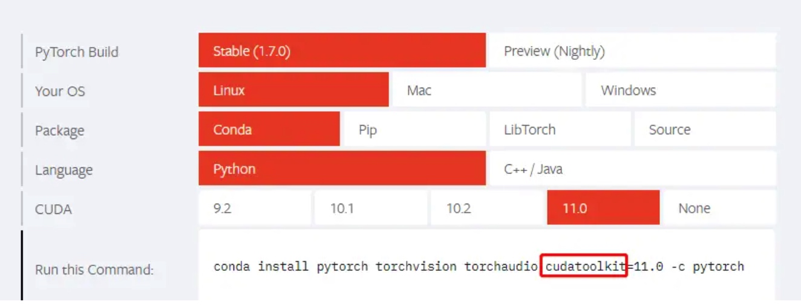

## CUDA配置 

### 【CUDA】nvcc和nvidia-smi显示的版本不一致？
 
 CW 近日在自己的机子上发现，nvcc --version 和 nvidia-smi 显示出来的CUDA版本不一致，其中前者显示的版本是10.2，而后者是11.0，但是深度学习相关的程序是能正常跑的，期间GPU也确实有在使用（通过nvidia-smi可以看出）。

由于个人一贯以来的“居安思危”风格，担心这种情况会埋坑，于是查阅了相关资料进行了解，正好也弥补了这部分知识的空白。本文会先解释下 nvcc --version 和 nvidia-smi 各自显示出来的版本号的意义，然后分享下多版本CUDA切换的经验，最后再补充下如何正确选择与CUDA版本匹配的Pytorch。

### nvcc 和 nvidia-smi

nvcc 属于CUDA的编译器，将程序编译成可执行的二进制文件，nvidia-smi 全称是 NVIDIA  System Management Interface ，是一种命令行实用工具，旨在帮助管理和监控NVIDIA GPU设备。

CUDA有 runtime api 和 driver api，两者都有对应的CUDA版本， nvcc --version 显示的就是前者对应的CUDA版本，而 nvidia-smi显示的是后者对应的CUDA版本。
用于支持driver api的必要文件由 GPU driver installer 安装，nvidia-smi就属于这一类API；而用于支持runtime api的必要文件是由 CUDA Toolkit installer 安装的。nvcc是与CUDA Toolkit一起安装的CUDA compiler-driver tool，它只知道它自身构建时的CUDA runtime版本，并不知道安装了什么版本的GPU driver，甚至不知道是否安装了GPU driver。

CUDA Toolkit Installer通常会集成了GPU driver Installer，如果你的CUDA均通过CUDA Tooklkit Installer来安装，那么runtime api 和 driver api的版本应该是一致的，也就是说， nvcc --version 和 nvidia-smi 显示的版本应该一样。否则，你可能使用了单独的GPU driver installer来安装GPU dirver，这样就会导致 nvidia-smi 和 nvcc --version 显示的版本不一致了。

通常，driver api的版本能向下兼容runtime api的版本，即 nvidia-smi 显示的版本大于nvcc --version 的版本通常不会出现大问题。

### 如何选择与CUDA版本匹配的Pytorch
那么 nvcc --version 与 nvidia-smi 的版本不一致的情况下，有些朋友可能就会懵了：我该如何选择与CUDA版本匹配的Pytorch呢？（炼个丹也太南了吧~！）
其实，只要上去Pytorch官网瞄瞄，细心的你应该能够发现在命令中指定CUDA版本时，用的是 cudatoolkit，而 nvcc --version 显示的版本就是通过CUDA Toolkit Installer在安装时决定的，因此，我们应该选择与 nvcc --version 对应的CUDA版本匹配的Pytorch。

相对而言，nvidia-smi 显示的是driver api对应的CUDA版本，若使用了单独的GPU driver Installer来安装驱动，那么nvidia-smi显示的版本与CUDA Toolkit所安装的版本就很可能不一致了。