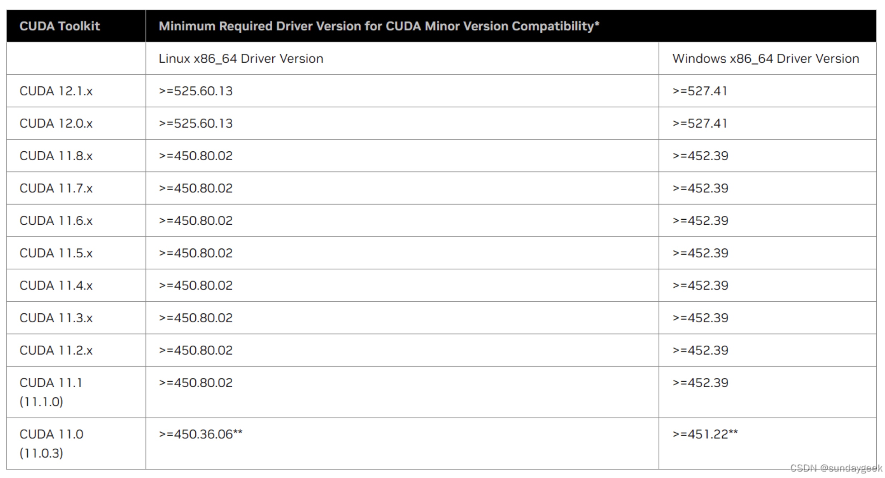

## YOLOV8官网

> [yolov8 官网](https://docs.ultralytics.com/)

## 运行环境配置
nvcc -V  查看cuda版本

1. 安装python虚拟环境[参考](python/2.虚拟环境.md)
2. 历史版本 显卡驱动下载https://www.nvidia.com/download/find.aspx
3. cuDNN ，根据对应CUDA版本选择下载， 下载地址 https://developer.nvidia.com/rdp/cudnn-archive
4. CUDA版本下载地址 https://developer.nvidia.com/cuda-toolkit-archive
5. CUDA 对应显卡驱动版本

## YOLOV5官网
后续慢慢补充